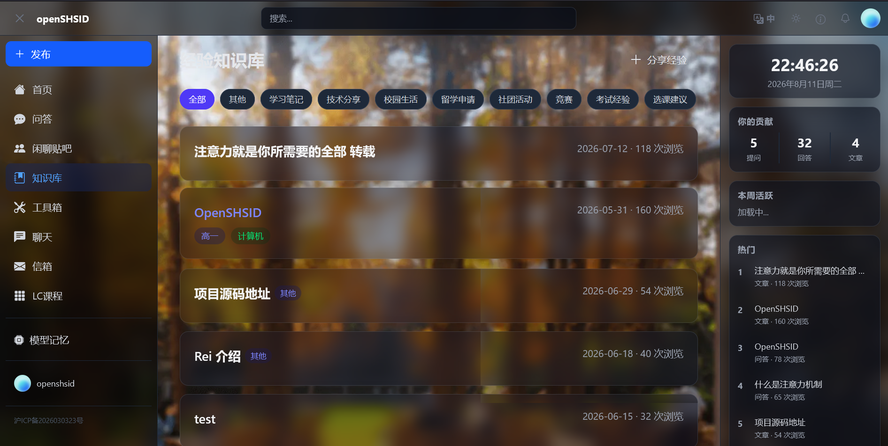

<!--
标题 + 徽章区
建议使用 shields.io 生成徽章，替换下面的链接
-->
<p align="center">
  
</p>

<h1 align="center">OpenSHSID</h1>

<p align="center">
  <em>Modern version of SHSID website</em>
</p>

[//]: # (## ✨ 特性)

[//]: # ()
[//]: # (- ⚡ **高性能** – 基于 [某某技术]，处理速度提升 **300%**)

[//]: # (- 🧩 **可扩展** – 支持插件/中间件，轻松集成)

[//]: # (- 📦 **开箱即用** – 零配置启动，默认配置已优化)

[//]: # (- 🌍 **跨平台** – 支持 Windows / macOS / Linux)

[//]: # (- 📚 **详尽文档** – 包含交互式示例和 API 参考)

---

## 🖼️ 演示

<p align="center">
  
  <br/>
  <em>图1：UI 界面截图</em>
</p>

---

## 🚀 快速开始

> 启动脚本已经打包进一个批注理中

[//]: # (### 前置要求)

[//]: # ()
[//]: # (- [Node.js]&#40;https://nodejs.org/&#41; v18 或更高)

[//]: # (- npm / yarn / pnpm)

### 运行

```shell
./scripts/start.ps1
```

```shell
docker pull (还没确定下来)
```
